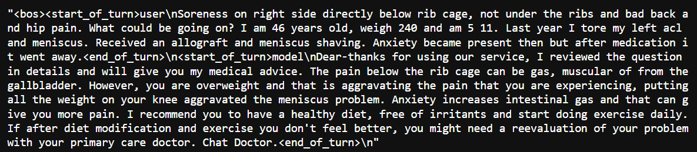
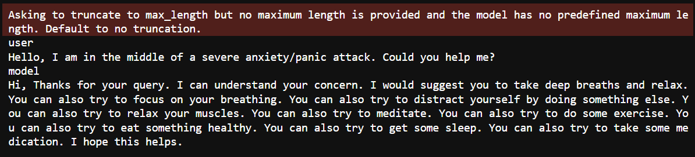
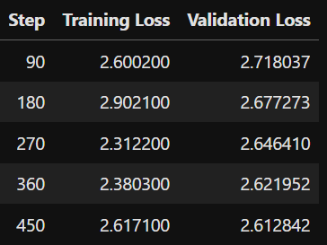

Baymax Chat: chatbot for health care assistance
=====================================================================

> "I cannot deactivate until you say that you are satisfied with your care." - Baymax

Baymax is a powerful tool designed to provide healthcare assistance and support through conversational AI. It aims to provide compassionate and reliable healthcare support, inspired by the caring nature of Baymax from Big Hero 6.

## Model Details

- **Base Model**: `google/gemma-2-9b`
- **Fine-tuned Model**: `samarth1029/Gemma-2-9b-baymax`
- **Quantized Format**: GGUF (4-bit quantization) for local inference with llama.cpp
- **Parameters**: 9.24B

## Table of Contents

- [Sample Results](#sample-results)
- [Installation](#installation)
- [Setup](#setup)
- [Inference with Python Script](#inference-with-python-script)
- [Inference with llama.cpp (GGUF format)](#inference-with-llamaccp-gguf-format)
- [Example Usage](#example-usage)

## Sample Results

Here are some sample results from the project:

### Dataset Sample


### Sample Inference


### Training Loss


## Installation

To use this model for inference,

```bash
bash setup.sh
```

## Setup

To get started with Baymax, you’ll need to set up some environment variables for Hugging Face and Weights & Biases authentication. These will allow you to access the model and log training or inference results as needed.

1. **Create a `.env` file** in the root directory of your project with the following contents:

    ```plaintext
    HUGGING_FACE_TOKEN=your_hf_token
    WANDB_TOKEN=your_wandb_token
    ```

   Replace `your_hf_token` and `your_wandb_token` with your actual Hugging Face and Weights & Biases API tokens.

2. **Install Required Libraries**

   Ensure you have the necessary dependencies installed:

    ```bash
    pip install -r requirements.txt
    ```

3. **Load Environment Variables**

   In your Python scripts, you can load these environment variables and use them for authentication as follows:

    ```python
    import os
    from dotenv import load_dotenv
    from huggingface_hub import login
    import wandb

    # Load tokens from .env file
    load_dotenv()
    hf_token = os.getenv("HUGGING_FACE_TOKEN")
    wandb_token = os.getenv("WANDB_TOKEN")

    # Authenticate with Hugging Face and Weights & Biases
    login(token=hf_token)
    wandb.login(key=wandb_token)
    ```

With these steps, you should be all set to begin using Baymax with authenticated access to Hugging Face and Weights & Biases.

## Inference with Python Script

To use Baymax for inference directly from Python, follow the example below.

### Example Script

This script demonstrates how to load the model and tokenizer, and perform inference on a sample input.

```python
import torch
from transformers import AutoModelForCausalLM, AutoTokenizer

# Load model and tokenizer
model_name = "samarth1029/Gemma-2-9b-baymax"
model = AutoModelForCausalLM.from_pretrained(model_name, low_cpu_mem_usage=True).to("cuda")
tokenizer = AutoTokenizer.from_pretrained(model_name)

# Sample input for inference
messages = [{"role": "user", "content": "Hello, I am in the middle of a severe anxiety/panic attack. Could you help me?"}]
prompt = tokenizer.apply_chat_template(messages, tokenize=False, add_generation_prompt=True)
inputs = tokenizer(prompt, return_tensors="pt", padding=True, truncation=True).to("cuda")

# Generate response
outputs = model.generate(**inputs, max_new_tokens=150)
response = tokenizer.decode(outputs[0], skip_special_tokens=True)
print("Generated Response:", response)
```
This script initializes the model, formats an example message, and generates a response. Make sure to replace `cuda` with`cpu` if you’re not using a GPU.

# Inference with llama.cpp (GGUF format)

To run Baymax using the GGUF quantized model format on llama.cpp, follow these steps:

## Install llama.cpp

On macOS or Linux, you can install llama.cpp with Homebrew:

```bash
brew install llama.cpp
```

## CLI Usage

To infer a response using llama.cpp, use the following command:

```bash
llama-cli --hf-repo samarth1029/Gemma-2-9b-baymax-Q4_K_M-GGUF --hf-file gemma-2-9b-baymax-q4_k_m.gguf -p "Hello, I am in the middle of a severe anxiety/panic attack. Could you help me?"
```

## Server Usage

Alternatively, you can run llama.cpp as a server for continuous requests:

```bash
llama-server --hf-repo samarth1029/Gemma-2-9b-baymax-Q4_K_M-GGUF --hf-file gemma-2-9b-baymax-q4_k_m.gguf -c 2048
```

## Manual Installation and Usage

If you'd prefer to clone and compile llama.cpp directly, you can do so with the following steps:

### Clone the Repository:

```bash
git clone https://github.com/ggerganov/llama.cpp
```

### Build llama.cpp with Required Flags:

Navigate to the llama.cpp folder and compile it with `LLAMA_CURL=1` along with other hardware-specific flags (e.g., `LLAMA_CUDA=1` for NVIDIA GPUs on Linux).

```bash
cd llama.cpp && LLAMA_CURL=1 make
```

### Run Inference:

You can use the CLI or server to infer responses from your GGUF model:

#### CLI:

```bash
./llama-cli --hf-repo samarth1029/Gemma-2-9b-baymax-Q4_K_M-GGUF --hf-file gemma-2-9b-baymax-q4_k_m.gguf -p "Hello, I am in the middle of a severe anxiety/panic attack. Could you help me?"
```

#### Server:

```bash
./llama-server --hf-repo samarth1029/Gemma-2-9b-baymax-Q4_K_M-GGUF --hf-file gemma-2-9b-baymax-q4_k_m.gguf -c 2048
```

> **Note:** Refer to the official llama.cpp repository for further instructions and alternative usage options.

## Example Usage

Here's a quick example to summarize using Baymax with llama.cpp:

```bash
# CLI
llama-cli --hf-repo samarth1029/Gemma-2-9b-baymax-Q4_K_M-GGUF --hf-file gemma-2-9b-baymax-q4_k_m.gguf -p "How can I manage my anxiety?"
```
```bash
# Server
llama-server --hf-repo samarth1029/Gemma-2-9b-baymax-Q4_K_M-GGUF --hf-file gemma-2-9b-baymax-q4_k_m.gguf -c 2048
```